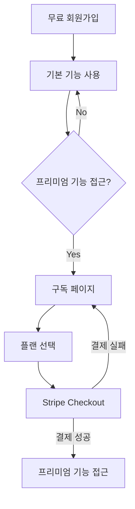

# 💰 비즈니스 모델 및 수익화 전략

## 1. Freemium 모델 구조

### 무료 티어
| 기능 | 제한 | 설명 |
|------|------|------|
| 반려동물 등록 | 최대 2마리 | 기본 프로필 정보 관리 |
| 케어 일정 | 기본 기능만 | 반복 일정, 알림 기능 제한 |
| 건강 기록 | 기본 기록만 | 상세 분석 및 통계 없음 |
| 광고 | 표시됨 | 앱 내 광고 표시 |

### 프리미엄 티어 (월 구독)
| 기능 | 혜택 | 가격 |
|------|------|------|
| 반려동물 등록 | 무제한 | ₩9,900/월 |
| 케어 일정 | 고급 반복 설정, 자동 추천 | 또는 |
| 건강 기록 | 상세 분석 및 통계 | ₩99,000/년 |
| 백업 | 데이터 자동 백업 및 내보내기 | (16.7% 할인) |
| 광고 | 제거됨 | |

### 프로 티어 (연간 구독)
| 기능 | 혜택 | 가격 |
|------|------|------|
| 프리미엄 기능 | 모든 프리미엄 기능 포함 | ₩199,000/년 |
| 전문가 상담 | 월 1회 무료 상담 | |
| 맞춤형 케어 | 개인화된 케어 플랜 | |
| 우선 지원 | 24시간 이내 응답 | |

## 2. Stripe 요금제 구조

### 제품 구성
```javascript
// Stripe 제품 정의
const product = {
  id: 'companion-care-subscription',
  name: '반려동물 케어 관리 구독 서비스',
  description: '반려동물의 건강과 일상을 체계적으로 관리하는 구독 서비스'
};
```

### 가격 플랜
```javascript
// Stripe 가격 플랜 정의
const prices = [
  {
    id: 'premium-monthly',
    nickname: '프리미엄 월간 구독',
    unit_amount: 9900,
    currency: 'krw',
    recurring: {
      interval: 'month'
    },
    product: product.id
  },
  {
    id: 'premium-yearly',
    nickname: '프리미엄 연간 구독',
    unit_amount: 99000,
    currency: 'krw',
    recurring: {
      interval: 'year'
    },
    product: product.id
  },
  {
    id: 'pro-yearly',
    nickname: '프로 연간 구독',
    unit_amount: 199000,
    currency: 'krw',
    recurring: {
      interval: 'year'
    },
    product: product.id
  }
];
```

## 3. 결제 흐름

### 사용자 관점


### 관리자 관점
- Stripe 대시보드에서 구독 현황 모니터링
- 결제 실패 및 구독 취소 알림 설정
- 월간/연간 매출 보고서 확인
- 고객 피드백 기반 요금제 조정

## 4. Webhook 처리

| 이벤트 | 처리 방법 |
|--------|----------|
| 결제 성공 | 사용자 계정 업그레이드, 환영 이메일 발송 |
| 결제 실패 | 사용자에게 알림, 재시도 안내 |
| 구독 취소 | 만료일까지 서비스 유지, 피드백 요청 |
| 구독 변경 | 일할 계산 적용, 확인 이메일 발송 |

## 5. 마케팅 전략

### 전환율 목표
- 무료 → 유료: 5%
- 월간 → 연간: 30%
- 프리미엄 → 프로: 10%

### 프로모션 계획
- 신규 가입자: 첫 달 50% 할인
- 시즌별 할인: 반려동물의 날, 블랙프라이데이 등
- 추천 프로그램: 친구 초대 시 1개월 무료

## 6. 구현 계획

### 1단계: 기본 결제 시스템 (1-2주)
- [ ] Stripe API 연동
- [ ] 결제 페이지 UI 구현
- [ ] 기본 Webhook 처리

### 2단계: 구독 관리 (2-3주)
- [ ] 사용자 대시보드에 구독 정보 표시
- [ ] 구독 변경/취소 기능
- [ ] 결제 내역 및 영수증

### 3단계: 마케팅 자동화 (3-4주)
- [ ] 프로모션 코드 시스템
- [ ] 이메일 마케팅 연동
- [ ] 사용자 행동 분석

## 7. 향후 수익 확장 계획
- 반려동물 용품 제휴 마케팅 (커미션 수익)
- 전문가 상담 중개 수수료
- 맞춤형 케어 상품 판매
- 기업 파트너십 (동물병원, 펫샵 등)
