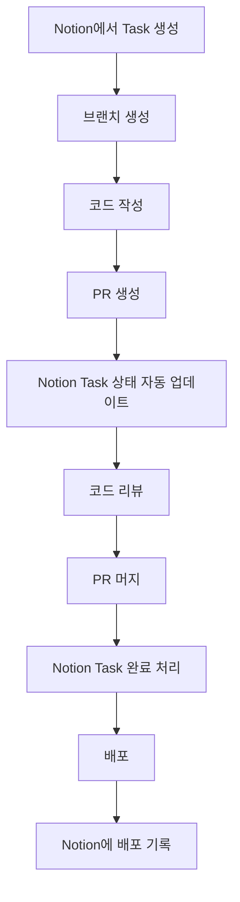

# 📝 Notion 워크플로우 연동 가이드

## 1. Notion 템플릿 구조

### 개발 Task 관리 템플릿


#### 기본 데이터베이스 구조
| 속성 | 타입 | 설명 |
|------|------|------|
| 제목 | Title | Task 이름 |
| 상태 | Select | 할 일 / 진행 중 / 검토 중 / 완료 / 보류 |
| 우선순위 | Select | 긴급 / 높음 / 중간 / 낮음 |
| 유형 | Multi-select | 기능 / 버그 / 리팩토링 / 문서 / 디자인 |
| 담당자 | Person | 작업 담당자 (혼자 개발 시 본인) |
| 마감일 | Date | 완료 목표일 |
| 예상 시간 | Number | 예상 소요 시간 (시간) |
| 실제 시간 | Number | 실제 소요 시간 (시간) |
| 관련 PR | URL | GitHub Pull Request 링크 |
| 메모 | Text | 추가 정보 및 참고사항 |

#### 뷰 구성
1. **칸반 보드**: 상태별 Task 시각화
2. **일정 뷰**: 마감일 기준 캘린더 뷰
3. **리스트 뷰**: 우선순위 및 상태별 정렬
4. **갤러리 뷰**: 스크린샷 중심 UI 작업 추적

## 2. 스프린트 계획 템플릿

### 2주 스프린트 구조
```
📅 스프린트 #1 (2025-05-01 ~ 2025-05-14)

🎯 목표: [스프린트 주요 목표]

📋 계획된 작업:
- [ ] 작업 1
- [ ] 작업 2
- [ ] 작업 3

📊 완료 기준:
- [ ] 기준 1
- [ ] 기준 2

📝 회고:
- 잘한 점:
- 개선할 점:
- 다음 스프린트에 반영할 점:
```

### 분기별 로드맵 템플릿


| 분기 | 주요 목표 | 핵심 기능 | 마일스톤 |
|------|----------|----------|----------|
| Q2 2025 | 기본 기능 완성 | 케어 일정 CRUD, 반응형 UI | MVP 출시 |
| Q3 2025 | 수익화 모델 도입 | Stripe 결제, 프리미엄 기능 | 첫 수익 발생 |
| Q4 2025 | 사용자 확장 | 마케팅 자동화, 추천 시스템 | MAU 1,000명 |
| Q1 2026 | 플랫폼 확장 | API 공개, 파트너십 | 생태계 구축 |

## 3. 버그 추적 템플릿

### 버그 리포트 구조
```
🐞 버그 제목

📱 환경:
- 브라우저: Chrome 120
- 기기: iPhone 13 / Desktop
- OS: iOS 16 / Windows 11
- 앱 버전: 1.2.0

🔍 재현 단계:
1. 
2. 
3. 

✅ 예상 동작:

❌ 실제 동작:

📷 스크린샷/영상:

🧩 관련 코드:
```

## 4. Notion API 연동

### API 설정 방법
1. [Notion Developers](https://developers.notion.com/) 방문
2. 새 통합 생성 (Create new integration)
3. 통합 토큰 발급 및 안전하게 저장
4. 데이터베이스 공유 및 권한 설정

### 필요한 패키지
```bash
npm install @notionhq/client
```

### 기본 연동 코드
```typescript
// lib/notion.ts
import { Client } from '@notionhq/client';

// Notion API 클라이언트 초기화
export const notion = new Client({
  auth: process.env.NOTION_API_KEY,
});

// 데이터베이스 ID
export const TASK_DATABASE_ID = process.env.NOTION_TASK_DATABASE_ID;
export const BUG_DATABASE_ID = process.env.NOTION_BUG_DATABASE_ID;

// Task 조회
export async function getTasks(filters = {}) {
  try {
    const response = await notion.databases.query({
      database_id: TASK_DATABASE_ID!,
      filter: filters,
    });
    
    return response.results;
  } catch (error) {
    console.error('Error fetching tasks from Notion:', error);
    throw error;
  }
}

// Task 생성
export async function createTask(taskData) {
  try {
    const response = await notion.pages.create({
      parent: {
        database_id: TASK_DATABASE_ID!,
      },
      properties: {
        제목: {
          title: [
            {
              text: {
                content: taskData.title,
              },
            },
          ],
        },
        상태: {
          select: {
            name: taskData.status || '할 일',
          },
        },
        우선순위: {
          select: {
            name: taskData.priority || '중간',
          },
        },
        // 기타 속성들...
      },
    });
    
    return response;
  } catch (error) {
    console.error('Error creating task in Notion:', error);
    throw error;
  }
}
```

## 5. CLI 도구 연동

### Task 관리 CLI 도구
```typescript
// scripts/notion-cli.ts
import { program } from 'commander';
import { getTasks, createTask } from '../lib/notion';
import chalk from 'chalk';

program
  .name('notion-cli')
  .description('Notion Task 관리 CLI 도구');

program
  .command('list')
  .description('Task 목록 조회')
  .option('-s, --status <status>', '상태별 필터링')
  .option('-p, --priority <priority>', '우선순위별 필터링')
  .action(async (options) => {
    try {
      const filter: any = {};
      
      if (options.status) {
        filter.status = {
          select: {
            equals: options.status,
          },
        };
      }
      
      if (options.priority) {
        filter.priority = {
          select: {
            equals: options.priority,
          },
        };
      }
      
      const tasks = await getTasks(filter);
      
      console.log(chalk.blue('📋 Task 목록:'));
      tasks.forEach((task: any) => {
        const title = task.properties.제목.title[0]?.text.content || '제목 없음';
        const status = task.properties.상태.select?.name || '-';
        const priority = task.properties.우선순위.select?.name || '-';
        
        console.log(
          `${chalk.green('➤')} ${chalk.bold(title)} [${chalk.yellow(status)}] [${chalk.red(priority)}]`
        );
      });
    } catch (error) {
      console.error(chalk.red('Error:'), error);
    }
  });

program
  .command('create')
  .description('새 Task 생성')
  .requiredOption('-t, --title <title>', 'Task 제목')
  .option('-s, --status <status>', '상태', '할 일')
  .option('-p, --priority <priority>', '우선순위', '중간')
  .action(async (options) => {
    try {
      const task = await createTask({
        title: options.title,
        status: options.status,
        priority: options.priority,
      });
      
      console.log(chalk.green('✅ Task 생성 완료:'), task.id);
    } catch (error) {
      console.error(chalk.red('Error:'), error);
    }
  });

program.parse();
```

### 사용 방법
```bash
# Task 목록 조회
npx ts-node scripts/notion-cli.ts list

# 특정 상태의 Task만 조회
npx ts-node scripts/notion-cli.ts list --status "진행 중"

# 새 Task 생성
npx ts-node scripts/notion-cli.ts create --title "Stripe 결제 연동" --priority "높음"
```

## 6. GitHub Actions 연동

### PR과 Notion Task 연결
```yaml
# .github/workflows/notion-pr.yml
name: Update Notion on PR

on:
  pull_request:
    types: [opened, closed, reopened]

jobs:
  update-notion:
    runs-on: ubuntu-latest
    steps:
      - name: Checkout code
        uses: actions/checkout@v3
        
      - name: Setup Node.js
        uses: actions/setup-node@v3
        with:
          node-version: '18'
          
      - name: Install dependencies
        run: npm ci
        
      - name: Update Notion Task
        env:
          NOTION_API_KEY: ${{ secrets.NOTION_API_KEY }}
          NOTION_TASK_DATABASE_ID: ${{ secrets.NOTION_TASK_DATABASE_ID }}
          PR_TITLE: ${{ github.event.pull_request.title }}
          PR_URL: ${{ github.event.pull_request.html_url }}
          PR_STATE: ${{ github.event.pull_request.state }}
        run: node scripts/update-notion-pr.js
```

### 스크립트 예시
```javascript
// scripts/update-notion-pr.js
const { Client } = require('@notionhq/client');

const notion = new Client({
  auth: process.env.NOTION_API_KEY,
});

async function updateNotionTask() {
  const { PR_TITLE, PR_URL, PR_STATE } = process.env;
  
  // Task 제목에서 PR 번호 추출 (예: "[TASK-123] 기능 구현")
  const taskIdMatch = PR_TITLE.match(/\[([^\]]+)\]/);
  const taskId = taskIdMatch ? taskIdMatch[1] : null;
  
  if (!taskId) {
    console.log('Task ID not found in PR title');
    return;
  }
  
  // Notion에서 해당 Task 검색
  const response = await notion.databases.query({
    database_id: process.env.NOTION_TASK_DATABASE_ID,
    filter: {
      property: '제목',
      title: {
        contains: taskId,
      },
    },
  });
  
  if (response.results.length === 0) {
    console.log(`Task with ID ${taskId} not found in Notion`);
    return;
  }
  
  const taskPage = response.results[0];
  
  // PR 상태에 따라 Task 상태 업데이트
  let newStatus;
  switch (PR_STATE) {
    case 'open':
      newStatus = '검토 중';
      break;
    case 'closed':
      // PR이 머지되었는지 확인하는 로직이 필요
      newStatus = '완료';
      break;
    default:
      newStatus = '진행 중';
  }
  
  // Notion Task 업데이트
  await notion.pages.update({
    page_id: taskPage.id,
    properties: {
      상태: {
        select: {
          name: newStatus,
        },
      },
      '관련 PR': {
        url: PR_URL,
      },
    },
  });
  
  console.log(`Updated Notion task ${taskId} with status: ${newStatus}`);
}

updateNotionTask().catch(console.error);
```

## 7. 자동화 워크플로우 예시

### 개발 사이클 자동화


### 일일 스탠드업 자동화
```typescript
// scripts/daily-standup.ts
import { getTasks, createTask } from '../lib/notion';
import { sendSlackMessage } from '../lib/slack';

async function generateDailyStandup() {
  // 어제 완료된 작업 조회
  const yesterdayCompleted = await getTasks({
    and: [
      {
        property: '상태',
        select: {
          equals: '완료',
        },
      },
      {
        property: '마지막 수정일',
        date: {
          after: new Date(Date.now() - 24 * 60 * 60 * 1000).toISOString(),
        },
      },
    ],
  });
  
  // 오늘 진행할 작업 조회
  const todayTasks = await getTasks({
    and: [
      {
        property: '상태',
        select: {
          equals: '진행 중',
        },
      },
    ],
  });
  
  // 스탠드업 메시지 생성
  const message = `
📅 일일 스탠드업 (${new Date().toLocaleDateString()})

✅ 어제 완료한 작업:
${yesterdayCompleted.map(task => `- ${task.properties.제목.title[0]?.text.content}`).join('\n')}

🔄 오늘 진행할 작업:
${todayTasks.map(task => `- ${task.properties.제목.title[0]?.text.content}`).join('\n')}
  `;
  
  // Slack에 메시지 전송
  await sendSlackMessage(message);
  
  console.log('Daily standup message sent!');
}

generateDailyStandup().catch(console.error);
```
