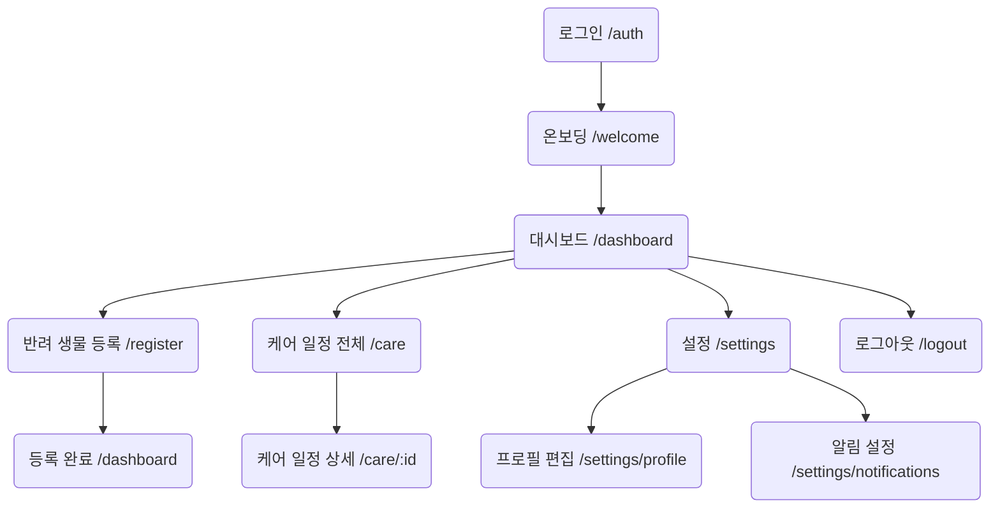

# Companion Care – 정보 구조(IA) 문서

> **탑바(Topbar) 내비게이션 · 로그인 필수**

---

## 1. 사이트 맵 (Site Map)



- **게스트** : `/auth` → 성공 시 `/welcome`  
- **회원** : `/dashboard` 이하 모든 경로 접근 가능

---

## 2. 사용자 플로우 (User Flow)

| 시나리오 | 단계 |
|----------|------|
| **초기 가입** | 1) `구글 로그인` 클릭 → 2) OAuth 인증 → 3) 온보딩에서 반려 생물 첫 등록 → 4) 주기·알림 설정 → 5) 대시보드 도착 |
| **케어 완료 처리** | 1) 이메일 알림 클릭 → 2) `/care/:id` 로드 → 3) **완료** 버튼 → 4) 다음 주기 자동 계산 → 5) 토스트로 ‘업데이트 완료’ |
| **알림 해제** | 1) 우측 아바타 → **설정** → 2) **알림 ON/OFF 토글** → 3) 서버에 PATCH → 4) 스낵바 확인 |

> 모든 흐름은 **로그인 상태 검증 후** 진행(토큰 만료 시 `/auth`로 리다이렉트).

---

## 3. 내비게이션 구조 (Navigation Structure)

| 위치 | 요소 | 설명 |
|------|------|------|
| **좌측** | `Companion Care` 로고 | 클릭 시 `/dashboard` |
| **중앙** | `대시보드`, `케어 일정`, `등록` | 키보드 Tab 순서 유지·ARIA `role="navigation"` 사용  ([Menu Structure | Web Accessibility Initiative (WAI) - W3C](https://www.w3.org/WAI/tutorials/menus/structure/?utm_source=chatgpt.com)) |
| **우측** | 알림 벨 아이콘, 사용자 아바타(드롭다운) | 드롭다운: 프로필·설정·로그아웃 |

**반응형**  
- `≥ 768 px` : 전체 링크 노출  
- `< 768 px` : 햄버거 버튼 → 슬라이드 메뉴 패턴(‘close on click’) 적용  ([Designing Navigation for Mobile: Design Patterns and Best Practices](https://www.smashingmagazine.com/2022/11/navigation-design-mobile-ux/?utm_source=chatgpt.com), [Best practice for responsive navigation : r/webdev - Reddit](https://www.reddit.com/r/webdev/comments/1b2zmby/best_practice_for_responsive_navigation/?utm_source=chatgpt.com))

---

## 4. 페이지 계층 (Page Hierarchy)

| 레벨 | 페이지 | 목적 |
|------|--------|------|
| 0 | `/auth` | 필수 인증 |
| 1 | `/dashboard` | 허브(가장 많이 방문) |
| 2 | `/care`, `/register`, `/settings` | 주 기능 |
| 3 | `/care/:id`, `/settings/profile` 등 | 상세·설정 하위 |

---

## 5. 콘텐츠 조직 (Content Organization)

| 페이지 | 주요 블록 | 접근성 고려 |
|--------|-----------|-------------|
| **대시보드** | (A) 반려 생물 카드 **Grid**<br>(B) 다가오는 일정 리스트<br>(C) CTA ‘등록’ | 카드에 `aria-label="몬스테라 물주기 D-1"` |
| **케어 일정** | 필터(생물별·기간별) + 테이블 | `<table>`에 `<caption>`·스코프 지정 |
| **등록** | 단계별 폼(1. 기본정보 2. 사진 3. 케어 주기) | 단계 진행 표시·폼 입력 오류 실시간 안내 |
| **설정** | 프로필 폼 + 알림 스위치 | 스위치에 ARIA `aria-checked` |

---

## 6. 인터랙션 패턴 (Interaction Patterns)

| 패턴 | 사용 위치 | 설명 |
|------|-----------|------|
| **Card → Modal** | 대시보드 카드 클릭 | 빠른 편집·삭제 |
| **Toast** | 모든 CRUD 성공/실패 | 4 초 노출·모션 리듬 200 ms |
| **Stepper** | 반려 생물 등록 | 진행률 시각화 |
| **E-mail deep-link** | 알림 메일 → `/care/:id` | 리마인더 UX 강화를 위한 직접 링크 |

**접근성** : 포커스 트랩·Esc 닫기·ARIA Live Region으로 Toast 읽기  ([Navigation Menubar Example | APG | WAI - W3C](https://www.w3.org/WAI/ARIA/apg/patterns/menubar/examples/menubar-navigation/?utm_source=chatgpt.com), [Understanding Guideline 2.4: Navigable | WAI - W3C](https://www.w3.org/WAI/WCAG21/Understanding/navigable?utm_source=chatgpt.com))

---

## 7. URL Structure (SEO 친화)

| 유형 | 패턴 | 예시 |
|------|-------|------|
| **대시보드** | `/dashboard` | - |
| **케어 일정 목록** | `/care` | - |
| **케어 상세** | `/care/{careId}` | `/care/123` |
| **반려 생물 프로필** | `/pet/{petId}` | `/pet/57` |
| **설정** | `/settings/{section}` | `/settings/notifications` |

- **의미 기반 슬러그** : `/pet/mons-terra-57` (향후 검색엔진 시멘틱 개선)  
- 하이픈 사용, 소문자, 파일 확장자 미포함 – SEO 권고  ([Website Navigation: 9 Best Practices, Design Tips and Warnings](https://www.orbitmedia.com/blog/website-navigation/?utm_source=chatgpt.com))  
- 301 리디렉션으로 옛 경로 유지

---

## 8. 컴포넌트 계층 (Component Hierarchy)

```txt
Layout
 ├── Topbar
 │    ├── LogoLink
 │    ├── NavLinks (Desktop) / Hamburger (Mobile)
 │    └── UserMenu
 └── Main
      └── Page…
DashboardPage
 ├── PlantAnimalCardList
 │     └── PlantAnimalCard
 ├── UpcomingCareList
 │     └── CareListItem
 └── FloatingCTA (+)
RegisterPage
 ├── Stepper
 ├── BasicInfoForm
 ├── PhotoUploader
 └── CareCycleForm
```

- **Atomic Design** 준수 : Button·Input 등 공유 컴포넌트 → Shadcn 기반  
- **ARIA Role** : `menubar`, `menuitem`, `dialog` 등 명시

---

## 9. 반응형·접근성·SEO 고려사항

| 영역 | 고려 사항 |
|------|-----------|
| **반응형** | 모바일 퍼스트, 320 px 최소·ARIA 유지, 토글식 햄버거로 nav 정리  ([Building Responsive Websites: How to Handle Navigation Menus](https://www.wired.com/2012/02/building-responsive-websites-how-to-handle-navigation-menus?utm_source=chatgpt.com)) |
| **접근성** | WCAG 2.1 **2.4 Navigable**·키보드 전용 탐색 보장, 색 대비 ≥ 4.5:1  ([Web Content Accessibility Guidelines (WCAG) 2.1 - W3C](https://www.w3.org/TR/WCAG21/?utm_source=chatgpt.com), [Understanding Guideline 2.4: Navigable | WAI - W3C](https://www.w3.org/WAI/WCAG21/Understanding/navigable?utm_source=chatgpt.com)) |
| **SEO** | `<title>`·`<meta description>` 동적 작성, JSON-LD Breadcrumb, sitemaps.xml 자동 생성 |

---

> **참고** : 본 IA는 PRD MVP 범위를 기준으로 하며, 버전 1.2 이후 AI 사진 등록 기능 추가 시 `/scan` 라우트 확장 예정.